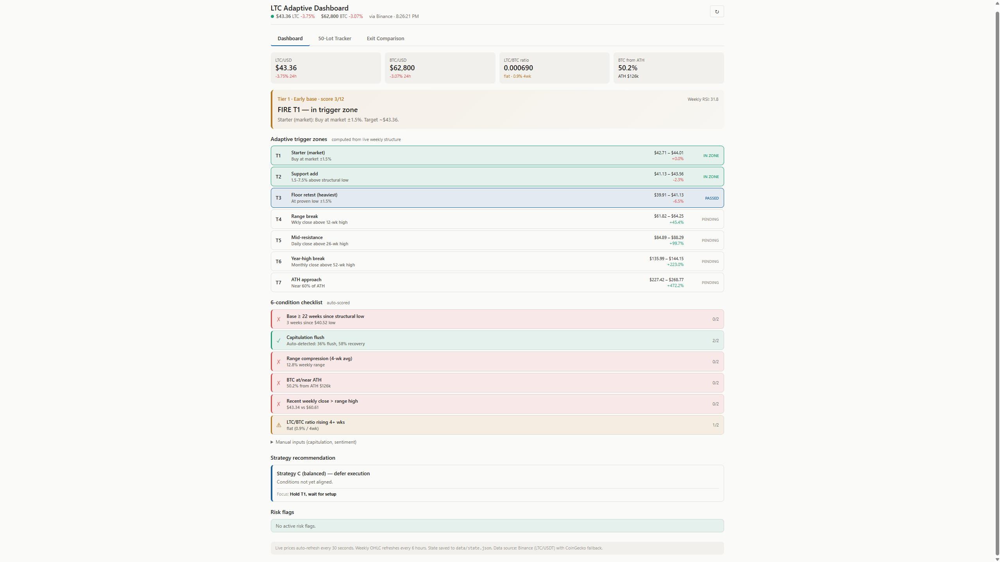

# LTC Adaptive Dashboard

A local Python web app for running a long-term Litecoin accumulation strategy with live market data — combining live prices, auto-computed structural levels, a conviction-scoring model, position tracking with full cost modelling, and exit-strategy comparison. Runs entirely on your own machine: no cloud, no accounts, state stays local.

> **Decision-support, not auto-trading.** The app surfaces live data and runs the analysis to inform sizing and timing — actual trades are placed in a broker, and positions shown are logged manually.



## What it does

Three tools, as tabs:

- **Dashboard** — a weekly check-in: live LTC/BTC, auto-computed structural levels (range, all-time high, weekly RSI, capitulation-flush detection), a six-condition checklist, and a conviction-weighted strategy recommendation.
- **50-Lot Tracker** — log fills and watch live equity with the real costs baked in: swap, spread, margin, and liquidation price. Auto-fills entry at the current live price.
- **Exit Comparison** — four exit strategies side-by-side, with a what-if matrix across peak-price scenarios and defaults that auto-adapt to the live price.

## Architecture

The app splits into a thin Python backend and a vanilla-JavaScript frontend that runs the analysis client-side.

```
Browser (frontend — vanilla JS)                 Server (backend — Flask)            External
───────────────────────────────                 ────────────────────────            ────────
 index.html + app.js + widgets                   server.py
   │                                               │
   │  every 30s:  setInterval → fetch('/api/prices')   (AJAX)
   ├──────────────────────────────────────────────►  /api/prices ──HTTP GET──► Binance REST API
   │                                               │                            (CoinGecko fallback)
   │  ◄───────────────── JSON ─────────────────────  ◄──────── JSON ───────────
   │                                               │
   │  updates App.live → updateLiveBanner (innerHTML / DOM) → re-renders widgets
   │                                               │
   │  weekly candles (cached 6h, in memory)  ────►  /api/weekly ──HTTP GET──► Binance klines
   │                                               │
   │  state (debounced 500ms POST)  ─────────────►  /api/state  ──read/write──► data/state.json
```

Key points:

- **Backend (`server.py`)** is a thin data + persistence layer: it serves the page, exposes a small JSON API (`/api/prices`, `/api/weekly`, `/api/state`, `/api/health`), fetches market data, caches weekly candles **in memory** with a 6-hour TTL, and reads/writes state to a JSON file.
- **Frontend (`app.js` + widget files)** runs all the analysis in the browser — structural levels, the conviction score, ratio trends, and exit comparisons. It polls for fresh prices every 30 seconds and updates the DOM in place, with no page reload.
- **Two feeds, different cadences:** prices refresh every 30s; weekly candles are cached for 6 hours, since they change slowly and caching avoids redundant API calls and rate limits.

## Tech stack

- **Backend:** Python, Flask, `requests`
- **Frontend:** vanilla JavaScript, HTML, CSS (no framework, no build step)
- **Data:** JSON for both API responses and local state; Binance + CoinGecko REST APIs

## Design notes

A few decisions worth calling out:

- **Analysis runs client-side.** Keeping the heavy logic in the browser lets the backend stay a simple data layer and makes recalculation instant. The tradeoff: the logic is visible and editable in the browser — fine for a single-user local tool, but a trusted multi-user version would move it server-side.
- **Graceful degradation.** If Binance fails, the backend falls back to CoinGecko; if both fail it returns a 503 and the frontend surfaces the error rather than silently breaking.
- **In-memory caching with a TTL** for weekly data, to avoid hammering the API for data that only changes weekly.
- **Debounced state saves** — rapid edits don't spam the disk; the app waits 500ms after the last change before writing.

## Running it

Requires Python 3.10+.

```bash
pip install -r requirements.txt
python server.py
```

Then open `http://localhost:5000`. On Windows, right-click `start.ps1` → **Run with PowerShell**, which installs dependencies on first run and opens the browser for you. State is saved to `data/state.json`, created automatically on first run.

> `data/` is gitignored — logged positions stay on the machine and never enter the repo.

## Customization

- **Refresh interval** — in `static/app.js`, change the `30000` in `setInterval(() => window.refreshPrices(true), 30000)` (milliseconds).
- **Price source** — in `server.py`, edit `api_prices()`. The current order is Binance → CoinGecko fallback; you can swap in another JSON price API, or wire in a broker feed (e.g. MetaTrader 5 via `pip install MetaTrader5`, calling `mt5.symbol_info_tick(...)`) as a first option that falls back to the public APIs.
- **Strategy logic** — trigger zones, conditions, tranche structure, and exit strategies live in the `static/` widget files (`dashboard.js`, `tracker.js`, `exit-comparison.js`); all three share `app.js` for live data and state.

## Limitations

Deliberately scoped as a single-user local tool:

- No authentication — anyone with access to the machine can see it.
- Local development server, not hardened for the open internet.
- State is a single JSON file with no concurrency control — fine for one user, wouldn't scale to many.
- Decision-support only — no trade execution.

## Why I built it

I wanted to run a long-term LTC accumulation strategy off live data with consistent, rule-based decisions instead of ad-hoc ones, and to see equity, costs, and liquidation price update in real time.

## What I learned


- *structuring a Flask app with clear separation between data, persistence, and presentation*
- *the tradeoffs between running computation client-side vs server-side*
- *handling live APIs gracefully — fallbacks, timeouts, caching, and rate limits*
- *keeping state in sync between the browser and a file on disk*
- *polling and updating the DOM without reloading the page*

## What I'd do next


- *move the trusted logic server-side and add a database to support multiple users*
- *candle-chart visualisation*
- *direct MT5 broker integration for live positions*
- *automated tests around the cost and scoring logic*
